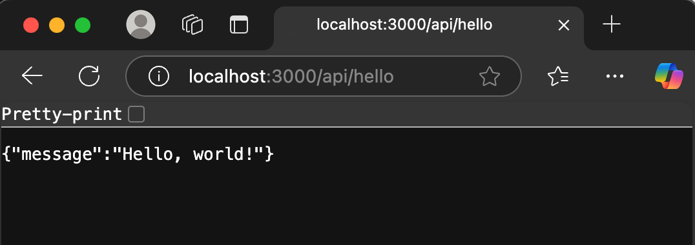

# Nodejs_Express_Sample

## 安裝 Node.js 
* Node.js 22 (LTS)
  * 下載安裝程式
    * https://nodejs.org/en/download
  * 測試安裝結果
    ```
    node -v
    ```
* 安裝 PostgreSQL v15
  * https://www.enterprisedb.com/download-postgresql-binaries
* 安裝 pgAdmin 4
  * https://www.pgadmin.org/download/pgadmin-4-windows/
* iisnode
  * https://github.com/azure/iisnode/wiki/iisnode-releases
* IIS URL Rewrite
  * https://www.iis.net/downloads/microsoft/url-rewrite

## 安裝套件
```
cd 到專案目錄
npm i
```

## 執行程式
```
nodemon index.js
```

## 看結果


## IIS 網頁伺服器
